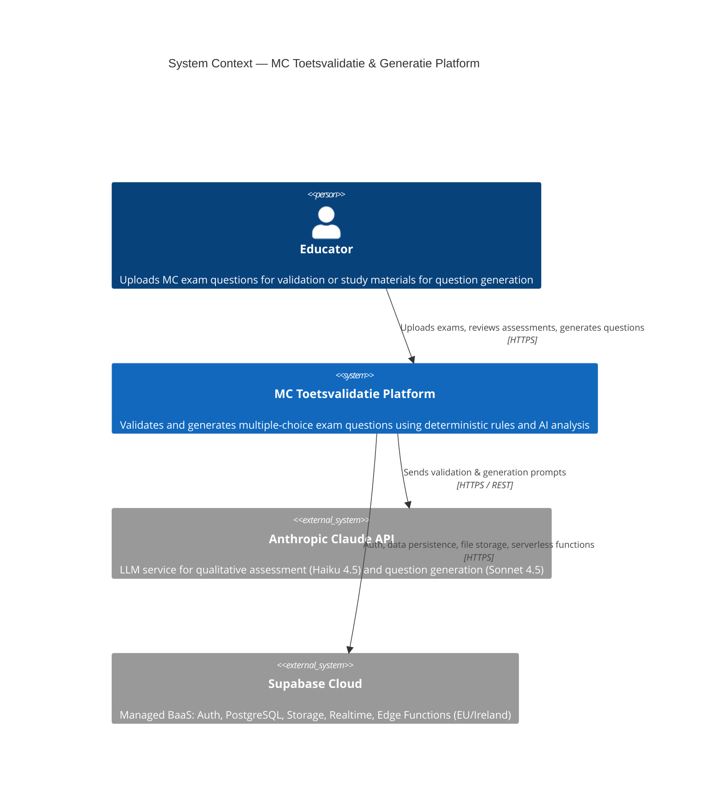
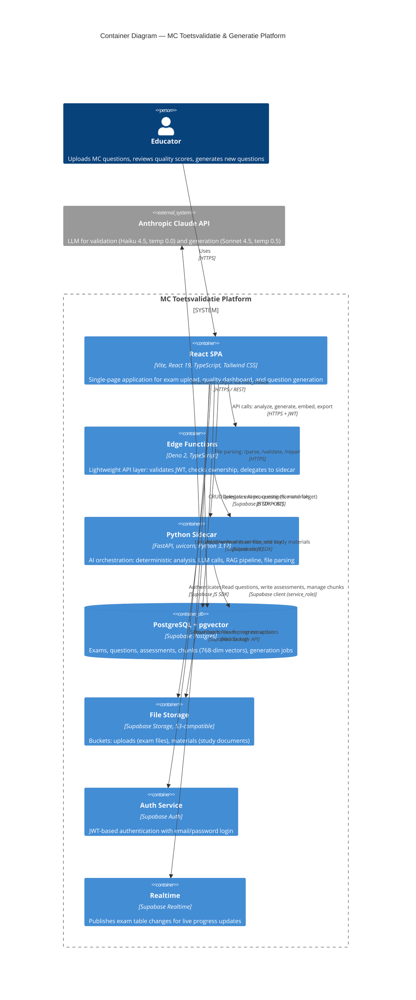
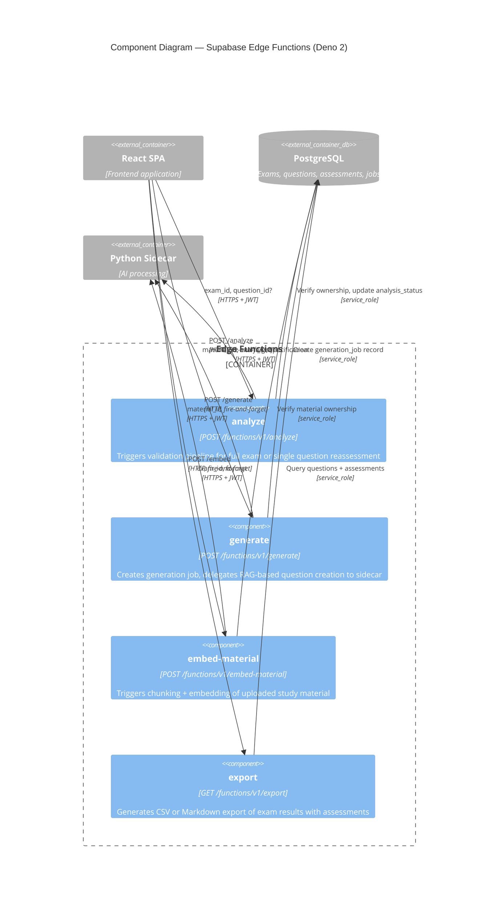

# C4 Architecture Model — MC Toetsvalidatie & Generatie Platform

## Level 1: System Context

## Level 2: Container

## Level 3: Component — Edge Functions

## Level 3: Component — Python Sidecar

```mermaid
C4Component
    title Component Diagram — Python Sidecar (FastAPI on Google Cloud Run, europe-west1)

    Container_Boundary(sidecar, "Python Sidecar") {

        Component(api, "FastAPI Routers", "HTTP endpoints", "Routes: /parse, /validate, /repair, /analyze, /embed, /generate, /health")

        Component(validation, "ValidationPipeline", "services/validation_pipeline.py", "Orchestrates 2-layer analysis per question, writes assessments, tracks progress")
        Component(generation, "GenerationPipeline", "services/generation_pipeline.py", "RAG retrieve → LLM generate → validate → store questions")
        Component(embedding, "EmbeddingPipeline", "services/embedding_pipeline.py", "Extract text → chunk → embed → store in pgvector")

        Component(deterministic, "DeterministicAnalyzer", "analyzers/deterministic.py", "Rule-based checks: longest-answer bias, homogeneity, absolute terms, negation")
        Component(llm, "LLMClient", "llm/client.py", "Claude API integration with structured output (tool_choice + JSON schema)")
        Component(prompts, "Prompt Builders", "llm/prompts/", "Constructs system + user messages with embedded criteria markdown")

        Component(embedder, "Embedder", "rag/embedder.py", "In-container multilingual-e5-base (768 dims) via sentence-transformers")
        Component(chunker, "Chunker", "rag/chunker.py", "Splits text into ~500-token chunks with 50-token overlap")
        Component(extractor, "Extractor", "rag/extractor.py", "Extracts text from PDF (pdfplumber), DOCX (python-docx), TXT")
        Component(retriever, "Retriever", "rag/retriever.py", "Embeds query, calls match_chunks() RPC for cosine similarity search")

        Component(parsers, "File Parsers", "parsers/", "Parses CSV, XLSX, DOCX exam files into structured questions")
    }

    ContainerDb_Ext(db, "PostgreSQL + pgvector", "Questions, assessments, chunks")
    Container_Ext(claude, "Anthropic Claude API", "Haiku 4.5 / Sonnet 4.5")
    Container_Ext(storage, "Supabase Storage", "Uploaded files")

    Rel(api, validation, "POST /analyze")
    Rel(api, generation, "POST /generate")
    Rel(api, embedding, "POST /embed")
    Rel(api, parsers, "POST /parse")

    Rel(validation, deterministic, "Layer 1: rule-based flags")
    Rel(validation, llm, "Layer 2: qualitative scores")
    Rel(validation, db, "Read questions, write assessments, increment progress")

    Rel(generation, retriever, "Retrieve relevant chunks")
    Rel(generation, llm, "Generate questions from chunks")
    Rel(generation, validation, "Auto-validate generated questions")
    Rel(generation, db, "Write questions, update job status")

    Rel(embedding, extractor, "Extract text from file")
    Rel(embedding, chunker, "Split into chunks")
    Rel(embedding, embedder, "Generate 768-dim embeddings")
    Rel(embedding, db, "Insert chunks + vectors")
    Rel(embedding, storage, "Download source file")

    Rel(llm, prompts, "Build messages from criteria files")
    Rel(llm, claude, "Structured output via tool_choice", "HTTPS")
    Rel(retriever, embedder, "Embed search query")
    Rel(retriever, db, "RPC match_chunks()", "Cosine similarity")

    UpdateLayoutConfig($c4ShapeInRow="4", $c4BoundaryInRow="1")
```

## Deployment Overview

| Container | Technology | Deployment Platform | Region |
|-----------|-----------|-------------------|--------|
| React SPA | Vite + React 19 + TypeScript | GitHub Pages | Global CDN |
| Edge Functions | Deno 2, TypeScript | Supabase Cloud | EU / Ireland |
| Python Sidecar | FastAPI, Python 3.12 | Google Cloud Run | europe-west1 |
| PostgreSQL + pgvector | Supabase Postgres | Supabase Cloud | EU / Ireland |
| File Storage | S3-compatible buckets | Supabase Cloud | EU / Ireland |
| Auth Service | Supabase Auth (JWT) | Supabase Cloud | EU / Ireland |
| Realtime | Supabase Realtime | Supabase Cloud | EU / Ireland |
