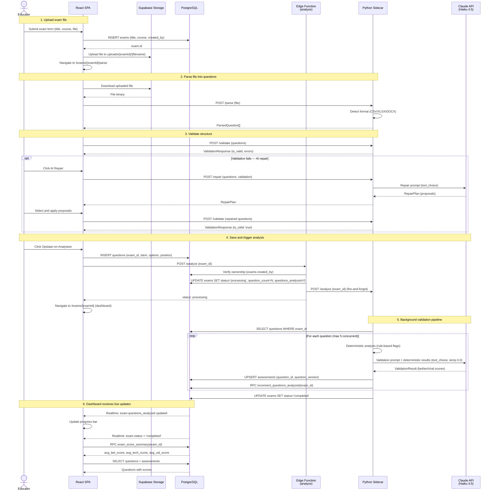
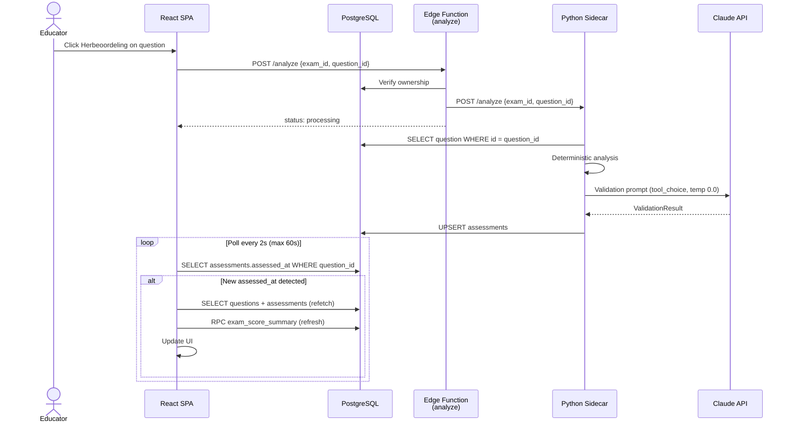
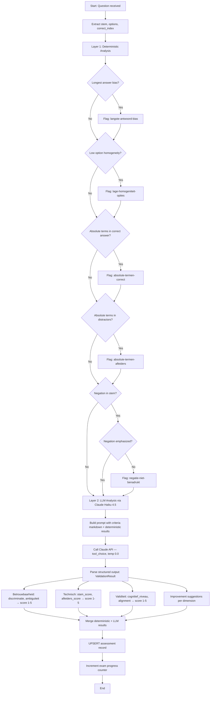
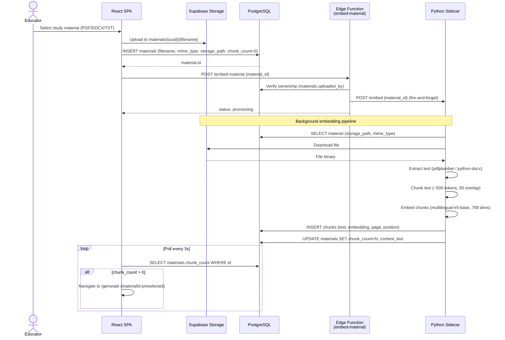
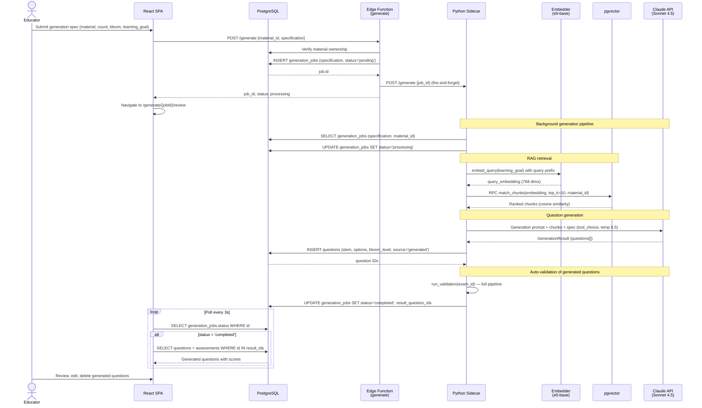
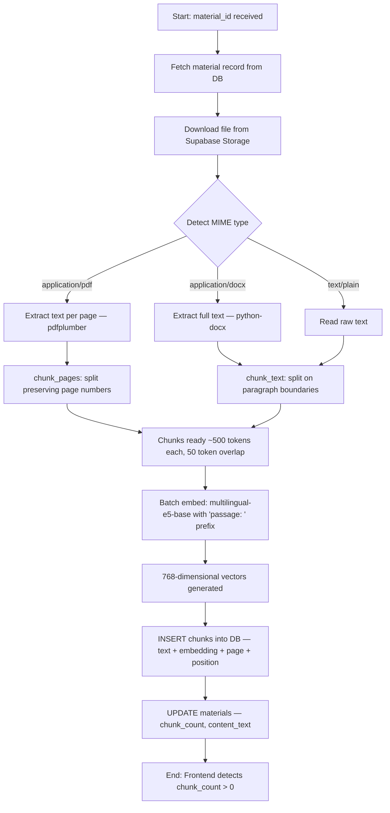
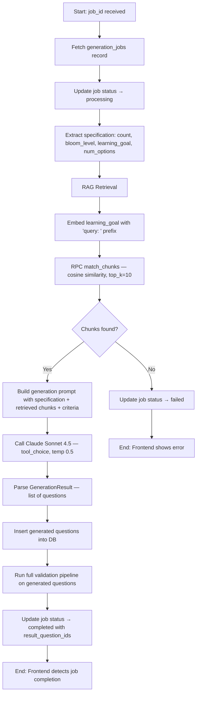
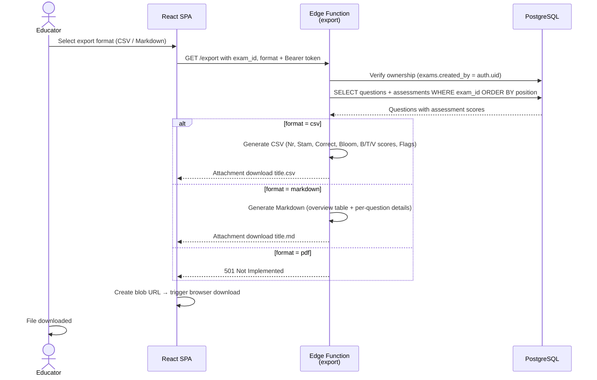
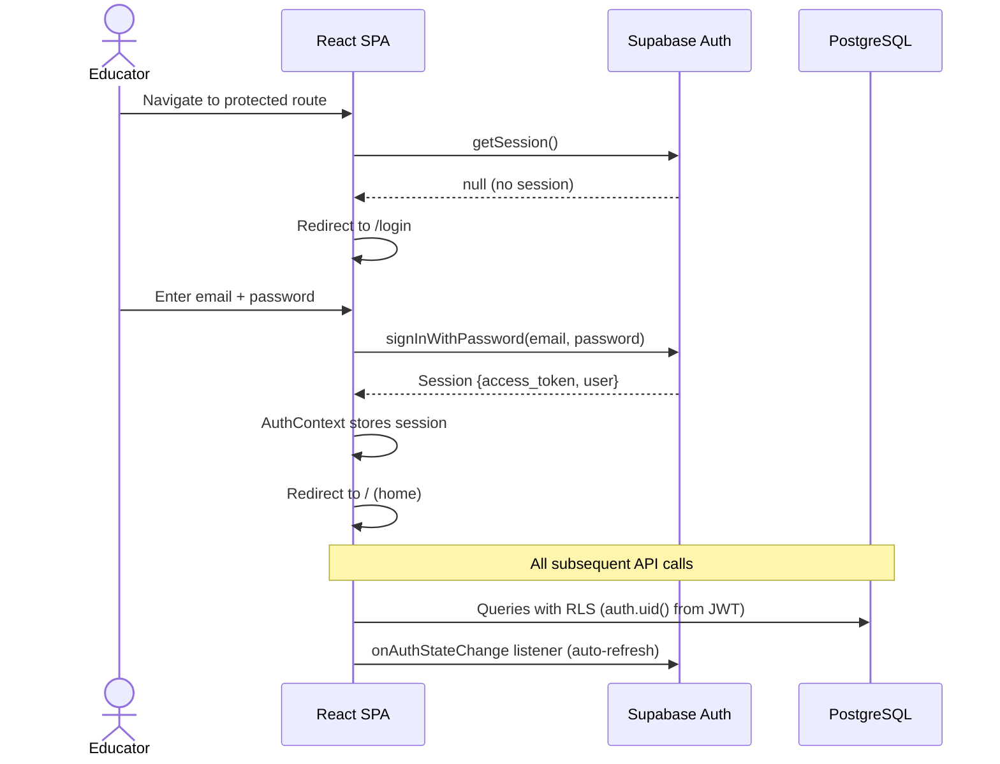

# Sequence & Activity Diagrams — MC Toetsvalidatie & Generatie Platform

---

## Module A: Validation

### Sequence: Exam Upload, Parse & Analyze

### Sequence: Single-Question Reassessment

### Activity: Validation Pipeline (per question)

---

## Module B: Generation

### Sequence: Material Upload & Embedding

### Sequence: Question Generation (RAG)

### Activity: RAG Embedding Pipeline

### Activity: Question Generation Pipeline

---

## Export

### Sequence: Exam Export

---

## Authentication

### Sequence: Login & Protected Route Access

